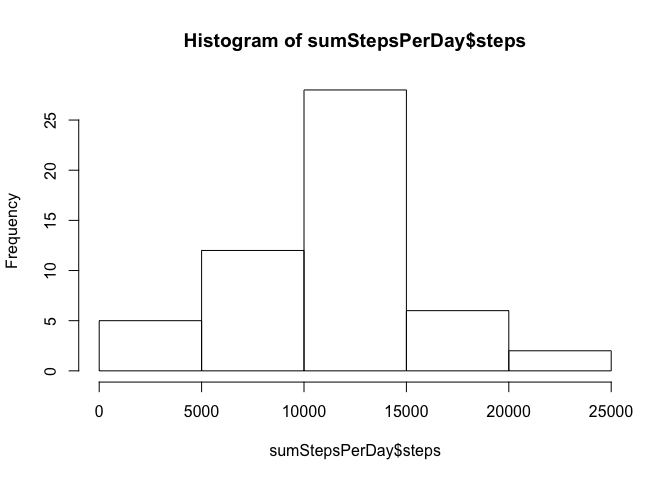
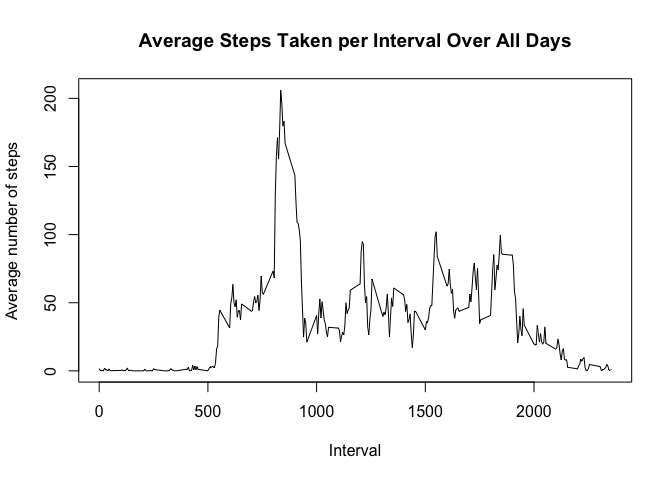
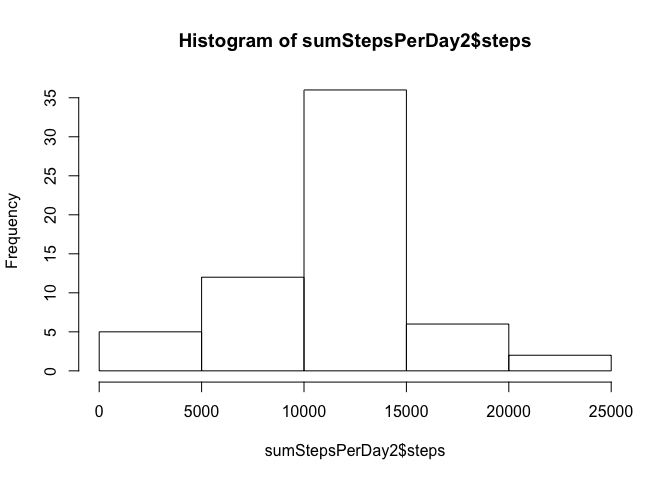
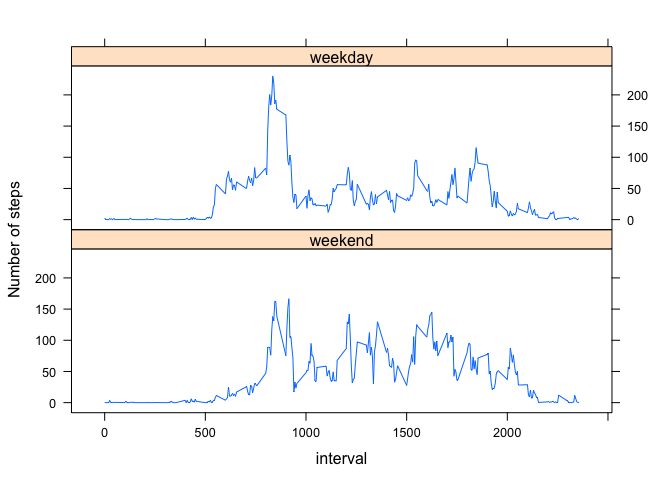

# Reproducible Research: Peer Assessment 1
## Reproducible Research - Wk2 - Assignment


Author: Phillip Telfer
Date: 27 Jun 2016

This report provides analysis of Activity Monitoring Data. 

The data set 'activity.zip' is unzipped to extract
'activity.csv' and then read into R


```r
unzip("activity.zip")
d <- read.csv("activity.csv")
```

### Total Number of Steps per Day

A histogram associated with the total steps taken per day, along with the Mean and Median total steps are calculated and dispalyed.


```r
sumStepsPerDay <- aggregate(steps ~ date, d, sum)
hist(sumStepsPerDay$steps)
```

<!-- -->

```r
meanSteps <- round(mean(sumStepsPerDay$steps), 2)
medianSteps <- median(sumStepsPerDay$steps)
```

The mean total number of steps per day is 10766.19.
The median total number of steps per day is 10765.

### Average Daily Activity Pattern

Review the pattern of steps across the day


```r
avStepsPerInterval <- aggregate(steps ~ interval, d, mean)
plot(avStepsPerInterval$interval, avStepsPerInterval$steps, type = "l", xlab = "Interval", ylab = "Average number of steps", main = "Average Steps Taken per Interval Over All Days")
```

<!-- -->

```r
maxAvSteps <- max(avStepsPerInterval$steps)
maxInterval <- avStepsPerInterval[avStepsPerInterval$steps == maxAvSteps, 1]
```

The maximum number of average steps per day (206.1698113), occurs during interval 835.

### Imputing missing values

Look at the NA values, replace missing data and re-calculate the total steps per day statistics


```r
numNA <- sum(is.na(d))
```

There are 2304 missing values within the dataset.

Missing values are imputed using the average for the missing interval. Using the updated dataset a histogram associated with the total steps taken per day, along with the Mean and Median total steps are calculated and dispalyed.


```r
dNA <- is.na(d[,1])
d2 <- d
for (i in 1:NROW(dNA)){
        if(dNA[i]){d2[i,1] <- avStepsPerInterval[avStepsPerInterval$interval == d[i,3],2]}
}
sumStepsPerDay2 <- aggregate(steps ~ date, d2, sum)
hist(sumStepsPerDay2$steps)
```

<!-- -->

```r
meanSteps2 <- round(mean(sumStepsPerDay2$steps), 2)
medianSteps2 <- round(median(sumStepsPerDay2$steps), 0)
```

For the updated data set:
The mean total number of steps per day is 10766.19.
The median total number of steps per day is 10766.

Looking at the original dataset values, the use of imputed values has not altered the mean or median values. This is a result of selecting an imputing methodology that largely conserves those values. The largest difference is in the frequency of days where between 10,000 and 15,000 steps were taken, with an increase from approximately 28 times to 35 times.

### Activity Patterns on Weekdays and Weekends

Investigate whether there are activity differences between the weekend and weekdays by plotting the average number of steps per interval for weekends and weekdays.


```r
wd <- strptime(d2$date, "%Y-%m-%d")
weekdays1 <- c('Monday', 'Tuesday', 'Wednesday', 'Thursday', 'Friday')
d2 <- cbind(d2, factor((weekdays(wd) %in% weekdays1), levels=c(FALSE, TRUE), labels=c('weekend', 'weekday')))
names(d2) <- c("steps", "date", "interval", "weekday")

library(lattice)
t1 <- cbind(aggregate(steps ~ interval, split(d2, d2$weekday)[[1]], mean), "weekend")
t2 <- cbind(aggregate(steps ~ interval, split(d2, d2$weekday)[[2]], mean), "weekday")
names(t1) <- names(t2) <- c("interval", "avsteps", "dayofweek")
d3 <- rbind(t1, t2)
xyplot(avsteps ~ interval | dayofweek, data = d3, type = "l", layout = c(1, 2), ylab = "Number of steps")
```

<!-- -->
